# Frontend Mentor - Rock, Paper, Scissors

## The challenge

Your challenge is to build out this Rock, Paper, Scissors game and get it looking as close to the design as possible.

You can use any tools you like to help you complete the challenge. So if you've got something you'd like to practice, feel free to give it a go.

Your users should be able to:

- View the optimal layout for the game depending on their device's screen size
- Play Rock, Paper, Scissors against the computer
- Maintain the state of the score after refreshing the browser _(optional)_
- **Bonus**: Play Rock, Paper, Scissors, Lizard, Spock against the computer _(optional)_

### Rules

If the player wins, they gain 1 point. If the computer wins, the player loses one point.

#### Original

- Paper beats Rock
- Rock beats Scissors
- Scissors beats Paper

#### Bonus

- Scissors beats Paper
- Paper beats Rock
- Rock beats Lizard
- Lizard beats Spock
- Spock beats Scissors
- Scissors beats Lizard
- Paper beats Spock
- Rock beats Scissors
- Lizard beats Paper
- Spock beats Rock

### My Solution

"Play Rock, Paper, Scissors against the computer" project has been achieved by HTML5, CSS3 and Vanilla JS with no other frameworks.
Bonus game option has been added to the project:

## Here are some previews of the game

## Desktop view

Desktop view full page:

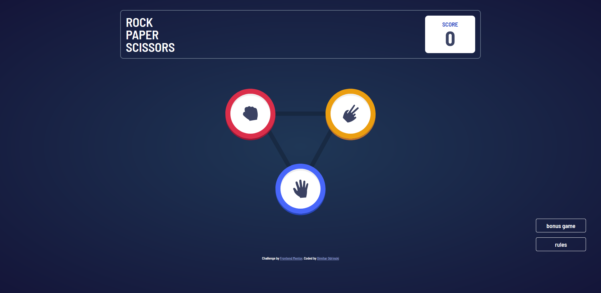

Desktop view with win result:

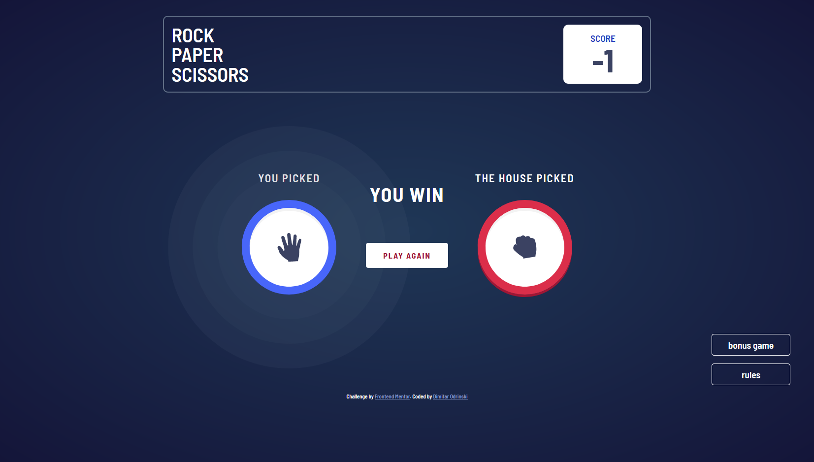

Desktop view with lose result:

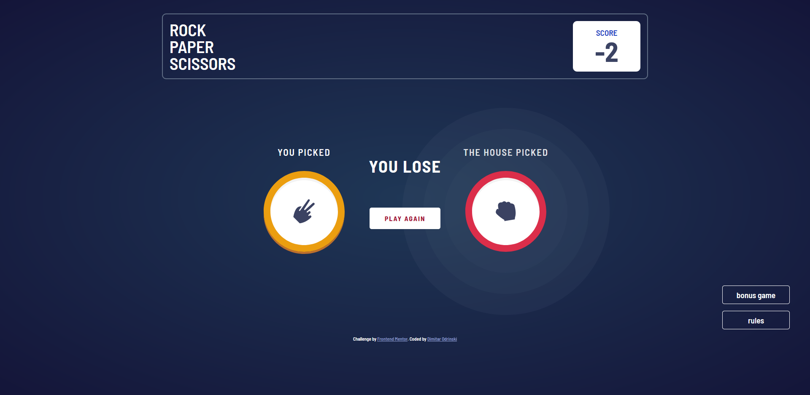

Desktop view - tie game:

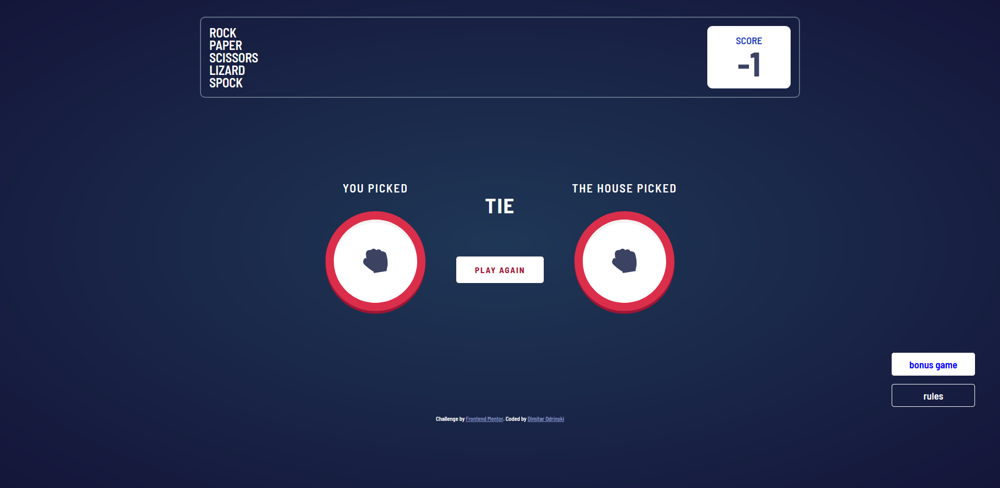

Tablet view - bonus game:

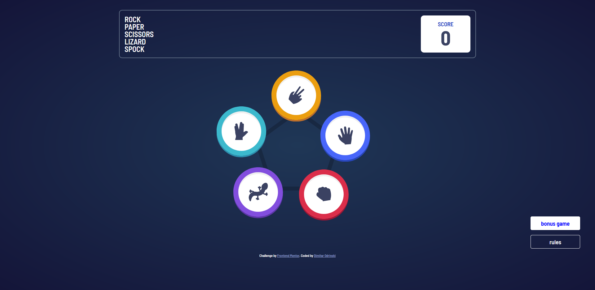

Tablet view - bonus game:

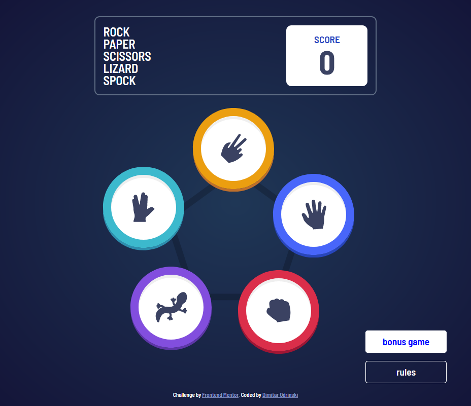

Tablet view - rules:

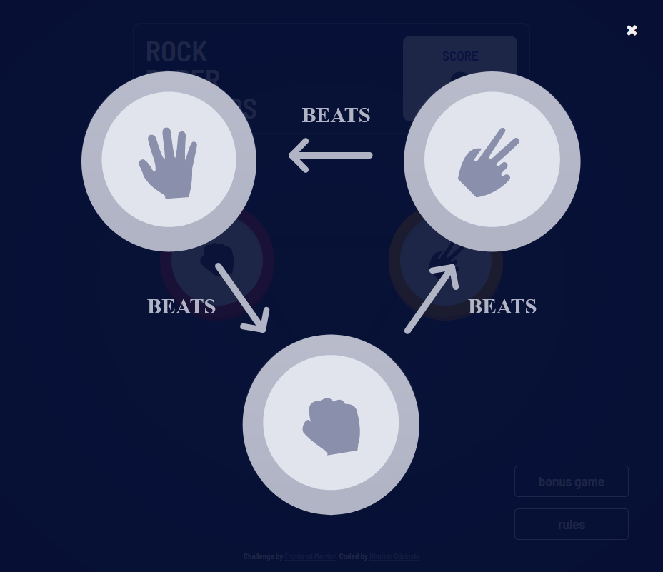

Tablet view - bonus rules:

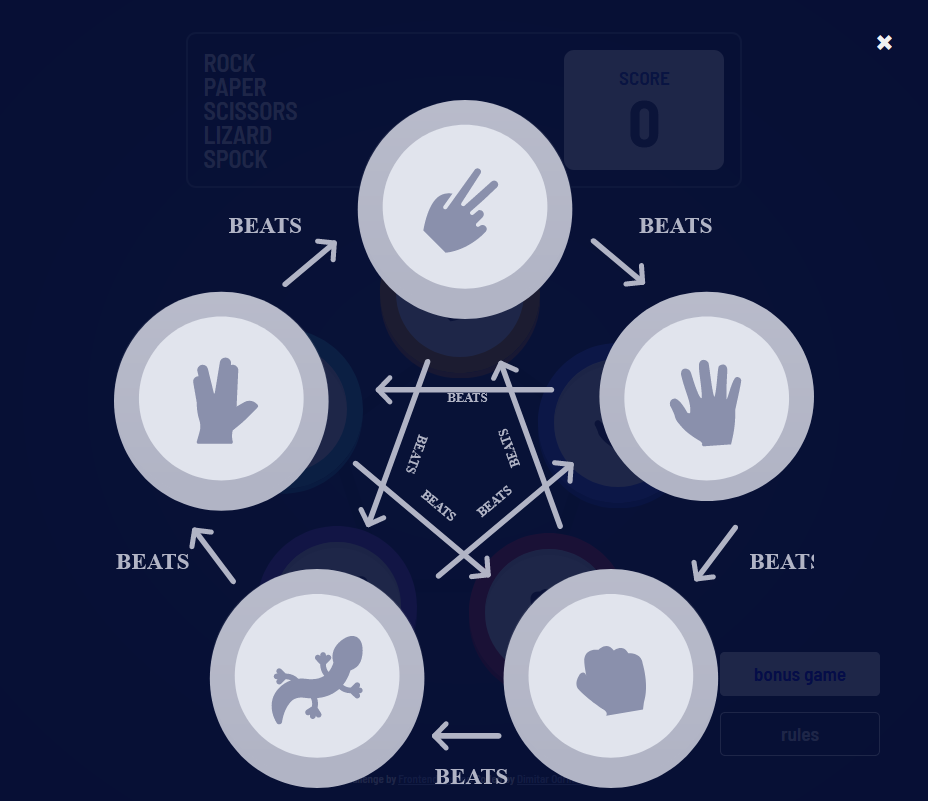

## Mobile view

Mobile view:

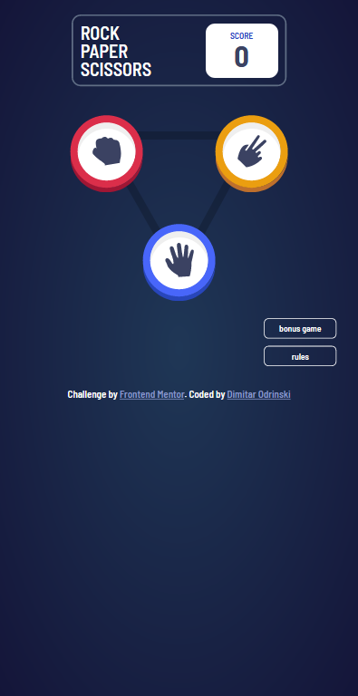

Mobile view with play:

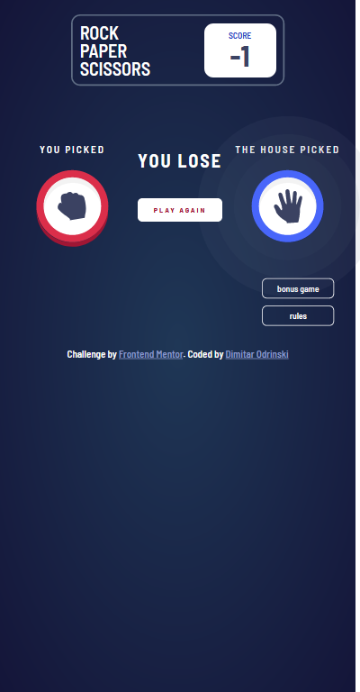

Mobile view - bonus game:

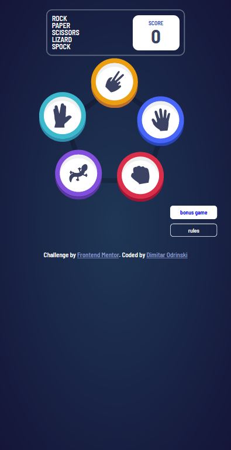

Mobile view bonus game rules:

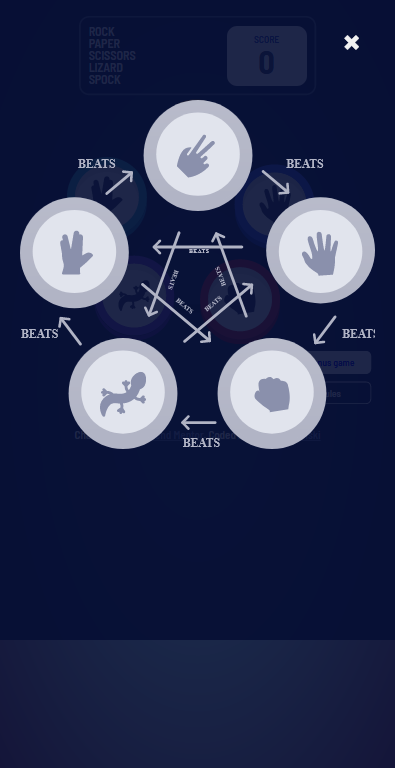

Mobile view - tie game:

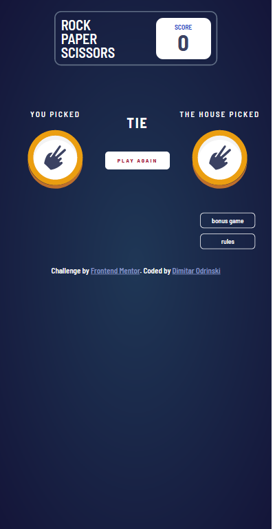

## Challenge specification

The design has been created to the following widths:

- Mobile: 375px
- Desktop: 1366px
